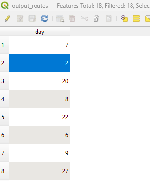

# GCP Route Planner — Technical Report

A road-network-aware routing tool for Ground Control Point (GCP) survey planning, built in Python using GeoPandas, NetworkX, OR-Tools, and scikit-learn.

---

## Results

<p align="center">
  <b>Input — GCP locations across the survey area</b><br>
  
</p>
<p align="center">
  <b>Output — Optimised daily routes following the road network</b><br>
  
</p>
<p align="center">
  <b>Attribute Table — Daily Clusters</b><br>
  
</p>

## Overview

Surveying large areas with GCPs requires careful logistical planning — teams must visit dozens (or hundreds) of points across real road networks while minimising travel time and avoiding impractically long daily drives. This tool automates that planning end-to-end: it reads a road network and a set of GCP locations, builds a routable graph, groups GCPs into feasible daily clusters, solves an optimal visit order for each day's cluster, and exports the resulting routes as a shapefile ready for use in QGIS or any GIS platform.

---

## Pipeline Architecture

The pipeline is implemented as a single class, `GCPRoutePlanner`, and runs in seven sequential steps.

```
Road Network (.shp) ──┐
                       ├──► Filter Roads ──► Build Graph ──► Snap GCPs ──► Repair ──► Distance Matrix ──► Cluster ──► TSP Solve ──► Export (.shp)
GCP Points (.shp)  ──┘
```

### Step 1 — Road Filtering

Only road types relevant to survey access are retained. The allowed types cover the full spectrum of navigable ways including motorways, primary and secondary roads, tracks (grades 1–4), footpaths, bridleways, and service roads. Filtering is done against a configurable `fclass` field, making it straightforward to adapt to different OpenStreetMap-derived datasets.

### Step 2 — Graph Construction

The filtered road geometries are converted into a weighted undirected graph using NetworkX. Each edge in the graph corresponds to a segment between two consecutive coordinate pairs along a LineString, with the edge weight set to the Euclidean distance between those coordinates (in the native CRS of the dataset). MultiLineString geometries are decomposed into their constituent LineStrings before processing.

### Step 3 — GCP Snapping

Each GCP point is projected onto the nearest road geometry using Shapely's `project` / `interpolate` pattern, which finds the closest point along the line rather than just the closest vertex. A maximum snap distance threshold (500 m by default) rejects GCPs that are too remote from any road. Snapped nodes that don't already exist in the graph are connected to their nearest existing node by a direct bridging edge.

### Step 4 — Connectivity Repair

After snapping, a dedicated repair pass identifies any GCP node that ended up outside the largest connected component of the graph and force-connects it to the nearest node that is inside that component. This guarantees that shortest-path queries will succeed for all GCPs, even in fragmented road networks.

### Step 5 — Distance Matrix

A full N×N road-network distance matrix is computed for all GCP nodes using NetworkX's `shortest_path_length` with edge weights. Pairs with no connecting path receive a large penalty value (10⁶ m) rather than raising an exception, keeping the matrix dense and solver-compatible.

### Step 6 — Daily Clustering

GCPs are grouped into daily work clusters using K-Means on their spatial coordinates. The number of clusters `k` is estimated from the average straight-line inter-GCP distance relative to the `max_distance_per_day` parameter (default 30 km). A post-processing pass iterates up to 10 times to dissolve any cluster with fewer than 2 GCPs, reassigning isolated points to the nearest cluster by network distance.

### Step 7 — TSP Routing

Each daily cluster is solved as a Travelling Salesman Problem using Google OR-Tools (`pywrapcp`). The solver uses the PATH_CHEAPEST_ARC first-solution strategy on the sub-matrix of network distances for that cluster's GCPs. The resulting node visit order is then expanded back through the full road graph using `nx.shortest_path` to produce a continuous, road-following polyline, which is exported as a GeoDataFrame.

---

## Key Design Decisions

**Snap-then-repair, not reject.** Rather than discarding GCPs that land outside the main connected component after snapping, the tool attempts to bridge them. This is important in rural areas where road networks are fragmented.

**Straight-line distances for cluster sizing, network distances for routing.** K-Means clustering uses geographic coordinates because network distances inflate inter-point estimates unpredictably, leading to over-clustering. Once clusters are formed, the full network distance matrix governs the TSP solve.

**Closure-safe distance callbacks.** The OR-Tools distance callback captures the sub-matrix by value via a default argument (`m=sub_matrix`) rather than by closure reference. This avoids a subtle bug where all callbacks in a loop would reference the same (final) matrix.

**0-based index alignment.** After snapping, the GCP GeoDataFrame index is reset to be 0-based and contiguous. This ensures that the distance matrix row/column indices stay aligned with the GeoDataFrame integer index used throughout routing and export.

---

## Dependencies

| Package | Role |
|---|---|
| `geopandas` | Spatial data I/O and geometry operations |
| `networkx` | Road graph construction and shortest-path queries |
| `shapely` | Point snapping, LineString construction |
| `scikit-learn` | K-Means clustering |
| `ortools` | TSP solver (Constraint Programming / VRP) |
| `numpy` | Distance matrix and array operations |
| `scipy` | KDTree (available for spatial lookups); `cdist` for cluster-size estimation |

---

## Usage

```python
from route_core import GCPRoutePlanner

planner = GCPRoutePlanner(
    road_path="data/roads.shp",
    gcp_path="data/gcps.shp"
)

planner.filter_roads(
    allowed_types=["primary", "secondary", "track", "path", ...],
    type_field="fclass"
)

planner.build_graph()
planner.snap_gcps()
planner.repair_disconnected_nodes()
planner.compute_distance_matrix()
planner.cluster_gcps(max_distance_per_day=30000)  # metres
planner.solve_routes()
planner.export_routes("data/output_routes.shp")
```

---

## Output

The exported shapefile contains one LineString feature per daily cluster. Each feature carries a `day` attribute (integer cluster label) and follows real road geometry between consecutive GCPs. The file can be loaded directly in QGIS, ArcGIS, or any GIS tool for field team navigation.

---

## Known Limitations and Future Work

- **CRS assumption.** Edge weights are computed as Euclidean distances in the dataset's native CRS. For geographic (degree-based) CRS, distances will be in degrees rather than metres. Reprojecting to a local metric CRS before running is strongly recommended.
- **Undirected graph.** The graph does not currently model one-way roads. Adding directed edges for one-way streets would improve route realism in urban areas.
- **Single vehicle per day.** The TSP solver assumes one team per daily cluster. Extending to a VRP formulation would support multi-team deployments.
- **Static snap threshold.** The 500 m maximum snap distance is hard-coded. Exposing this as a parameter would make the tool more adaptable to different data densities.
- **Scalability.** The O(N²) distance matrix computation becomes a bottleneck for large GCP sets. A sparse approximation (e.g., computing only k-nearest-neighbour distances) would significantly speed up large surveys.
